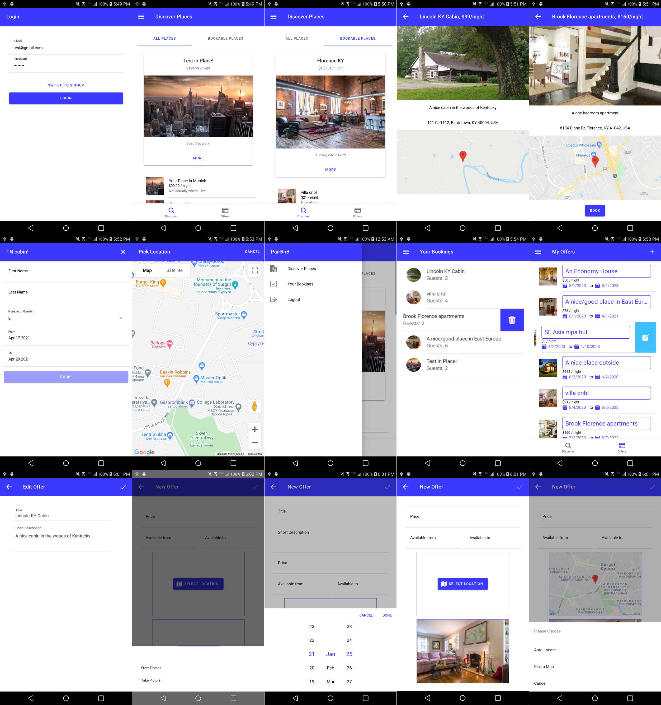
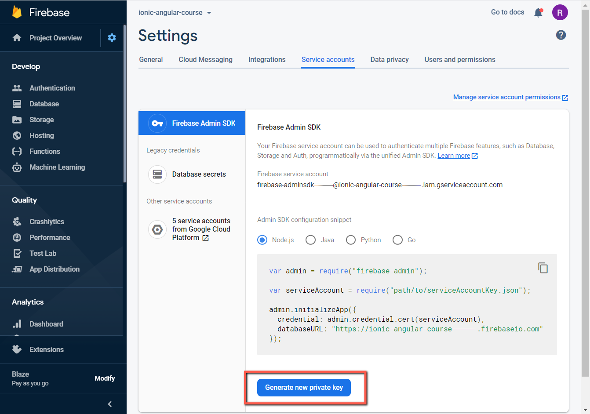

  
  I converted the online training material [Ionic - Build iOS, Android & Web Apps with Ionic & Angular](https://www.udemy.com/course/ionic-2-the-practical-guide-to-building-ios-android-apps/) in Udemy by Maximilian Schwarzmüller to Ionic React. 

You can see the source code of the training material [here](https://github.com/robhizon26/pairbnb-ionic-ng).

>You can check out Ionic Framework documentation [here](https://ionicframework.com/docs).

## See this app on Demo
1) You can run the Android app on this [directory](https://github.com/robhizon26/pairbnb-ionic-react/tree/master/android) using Android Studio that was built from this project. 
2) Or you can run [this](https://ionic-angular-course-e7fb6.web.app/auth) on the browser hosted on Firebase

When you run the app, you will be asked for login or signup for fictitious user. You may use my test user `test@gmail.com/password` credential if you just want to login and navigate the app. 
This is just the ready app that is connecting to my Firebase account and database.

 
## How to run this project on the browser
1. Create `.env` file on the root path with content of:
    ```javascript
    REACT_APP_firebaseAPIKey=your_firebaseAPIKey
    REACT_APP_googleMapsAPIKey='your_googleMapsAPIKey'
    REACT_APP_firebaseURL='your_firebaseURL'
    REACT_APP_fbStoreImageURL='your_fbStoreImageURL'
    ```

2. You need create a Firebase account because that is where the database is stored, that is where the image is uploaded, and that is where authentication is happening.

3. You need to initialize and to deploy Firebase function because that is where a logic for image upload is being deployed. It is made from nodeJs.

    Within the function folder you need to create `config.js` with the content of:
    ```javascript
    module.exports = {
        PROJECTID: 'YOUR_FIREBASE_PROJECT_ID'
    }
    ```
    You also need to create `ionic-app.json` with the content found on your Firebase project.
    
    
    ```javascript
      {
      "type": "service_account",
      "project_id": "---",
      "private_key_id": "---",
      "private_key": "---",
      "client_email": "---",
      "client_id": "---",
      "auth_uri": "---",
      "token_uri": "---",
      "auth_provider_x509_cert_url": "---",
      "client_x509_cert_url": "---"
    }
    ```

4. You can run *ng serve* or *npm start* to run the app on the browser.


 
## How to run this project on device

This project uses capacitor as its wrapper and mini web hosting server to creating native app, and its bridge to integrating to native API SDK such as the Camera and Location services. 

Once you've cloned or downloaded this project you may also build it in iOS if you prefer that platform. I build this app using Windows so I can only create android folder.

You can run on the terminal window *npm run build* and some of the capacitor cli commands such as *ionic capacitor add ios/android*, *ionic capacitor sync ios/android*, *ionic capacitor open ios/android*, and/or *ionic capacitor run ios/android*.

*npm run build* will create the www folder that will contain the transpiled javascripts, css, and index.html files. This is important because this will be the web app that will be wrapped by capacitor to be used as a native app in iOS or Android device.

*ionic capacitor add ios* or *ionic capacitor add android* will build and add the ios or android folder. That is basically the app that you can run on XCode or Android Studio respectively. You only need to run this once. Successive updates on the code doesn't need to re-run this command.

*ionic capacitor sync ios* or *ionic capacitor sync android* will sync any changes you've made on the app  only after you've run again *npm run build* to update the www folder.

*ionic capacitor open ios* or *ionic capacitor open android* will just open the app on XCode or Android Studio respectively. You may have to try it multiple times because, sometimes, it doesn't work on the first tries. Alternatively, you can just open Android Studio or XCode and directly open the project created on the android and ios folders respectively.

*ionic capacitor run ios* or *ionic capacitor run android* will just run all of capacitor cli commands mentioned above. So you can just solely use this one on any creation or update of ios and android folders.

 

